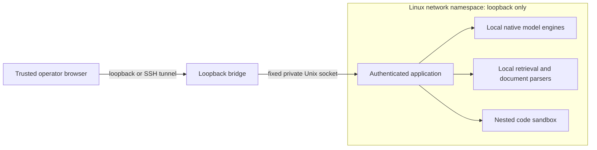

# BlackBox strict Linux deployment

**Established fact, 28 September 2026:** a [45.135-second namespace capture](validation/network-2026-09-28/namespace-headers-20260928T134140Z.json) during a real-model tender task recorded 1,168 IP packets, all loopback, with zero reported capture drops. The IP-header PCAP and its hash are retained beside the report. A native external TCP probe returned network-unreachable. This bounded sample does not certify the full host, future runs or GPU operation. The diagnostic script refuses namespaces with non-loopback interfaces; it is an operator-side diagnostic requiring raw-socket privileges, not a model tool.

**Established fact:** the Linux runtime was exercised on Ubuntu under WSL2, kernel `6.18.33.1-microsoft-standard-WSL2`, with Python 3.12 and bubblewrap. Both the application and a native child process passed the namespace checks. A real local 1.5B model completed the exact-file fixture inside that runtime. See [namespace evidence](validation/strict-linux-namespace.json), [real inference result](validation/strict-linux-exact.json), and [code sandbox checks](validation/strict-linux-sandbox.json).

**Informed inference:** the same design is suitable for a compatible Linux workstation or private cloud VM. Each deployment must run its own checks; WSL2 evidence is not validation of every Linux kernel, macOS, GPU driver or cloud environment.

## Boundary



The bridge accepts loopback connections and relays bytes to one fixed Unix socket. It has no arbitrary target URL or outbound TCP connector. The application, local model engines and parsers run inside a fresh network namespace. Nested code execution receives only its workspace and read-only interpreter/system files. It does not receive the application's private state or access key.

The outer runtime mounts explicit code, assets, models and interpreter directories read-only; only the selected workspace, private state and private bridge directory are writable. Host home, `/run`, Docker sockets, SSH agents and host temporary directories are not mounted. Existing special files such as Unix sockets in selected directory trees are rejected. Effective capabilities are dropped, privilege escalation is disabled, inherited nonstandard file descriptors are closed, and there is no unsafe fallback.

The current strict launcher is **CPU only**. GPU devices are not passed through. The portable launcher supports GPU settings separately, but that is not evidence that GPU operation has passed the strict profile's tests.

## Provision separately

Use a connected staging environment without confidential material. Install Python 3.12, bubblewrap, the locked Python dependencies, a reviewed Linux llama.cpp runtime and verified GGUF weights. Use the provisioner described in [PORTABLE_SETUP.md](PORTABLE_SETUP.md); the strict launcher never downloads anything.

Export the repository lock during staging:

```sh
uv export --frozen --no-dev --extra knowledge --extra vision --extra render --extra analysis --extra ocr \
  --no-emit-project --format requirements-txt --output-file requirements.lock
python3.12 -m pip download --require-hashes --only-binary=:all: \
  -r requirements.lock --dest wheelhouse
```

Transfer a reviewed source/build, manifest, native runtime, models and matching wheelhouse. On the disconnected Linux host:

```sh
python3.12 -m venv .venv
.venv/bin/python -m pip install --no-index --find-links wheelhouse \
  --require-hashes -r requirements.lock
```

The source launcher imports the local `server` package, so no editable installation is needed. Prefer the Linux filesystem for code, virtual environment and state. WSL paths mounted from Windows can be substantially slower. The state directory must be private, owned by the launching user, and mode `0700`; models and workspace must be separate from state and application directories. WSL uses Linux Python and Linux inference binaries, not Windows executables or a Windows virtual environment.

## Launch

Adapt these paths to the installation; all artifacts must already exist:

```sh
mkdir -p /srv/blackbox/state
chmod 700 /srv/blackbox/state
sh start-blackbox-strict.sh \
  --workspace /srv/blackbox/workspace \
  --data-dir /srv/blackbox/state \
  --models-dir /srv/blackbox/models \
  --llama-server /opt/llama/llama-server \
  --port 7331
```

Use `--verify-only` to run the native namespace and child checks without starting the application. Windows operators can run the same command within an installed Ubuntu WSL2 distribution. Native macOS and native Windows do not satisfy this launcher; use a tested Linux VM or keep the portable profile's unverified status visible.

The launcher creates `state/admin.key` with mode `0600`. Read it locally and enter it in the browser's access-key screen at `http://127.0.0.1:7331`. The key is not printed by the launcher or put into process command arguments. Do not copy it into task prompts. The application key is removed from child-process environments; native inference receives a separate generated key.

For a private cloud VM, connect through an authenticated SSH tunnel:

```sh
ssh -N -L 7331:127.0.0.1:7331 operator@private-host
```

The bridge binds only to loopback. Do not bind it publicly or replace it with an unrestricted proxy. One coordinator owns each state directory. Start a separate installation with separate state for another operator; enterprise identity and tenant isolation are not implemented.

## Verification and failure behavior

Startup requires all of these before exposing the API: loopback as the only interface, no non-loopback IPv4 routes, zero effective capabilities, `NoNewPrivs`, and native libc TCP/UDP probes returning kernel denial for public IPv4, public IPv6 and metadata addresses. It repeats the checks in a child interpreter that ignores Python environment hooks. A refusal, timeout, missing binary or successful connection is not treated as proof of isolation. The actual application repeats the check in its own namespace; a preflight result alone does not authorize startup.

The Security page reports the kernel, scope and individual results. It explicitly records **packet capture not performed**. These observations establish the tested network namespace configuration; they are not remote attestation, a penetration test, an independent security certification or evidence against kernel exploits.

Trust assumptions include the host administrator, kernel, hypervisor/cloud operator, installed binaries, directory owner and browser. A compromised browser, malicious extension, administrator or host process can read material outside the workload boundary. Read-only mounts prevent the application from editing code but do not prevent its owner from editing it concurrently; production code and runtime ownership should be separate from the service account. Backups, swap, disk encryption, retention and physical access need deployment controls.

Before confidential rollout, independently review the boundary and collect packet evidence on the intended host. Missing dependencies, failed native probes, a second coordinator or invalid private directory permissions stop startup. There is no download or unisolated retry path.

## Repeatable generated-code check

On the same host, with the service running and the evaluator dependencies already installed:

```sh
.venv/bin/python scripts/evaluate_workbench.py --case code \
  --url http://127.0.0.1:7331 --workspace /srv/blackbox/workspace \
  --token-file /srv/blackbox/state/admin.key --output code-evaluation.json
```

Omitting `--model` uses automatic routing. Supplying an installed model ID pins that model, including review. The evaluator checks the numeric JSON result independently, requires a saved successful isolated Python execution record, and requires terminal `done`. A correct file with a failed workflow does not pass. Use `--run-id` to inspect a prior run without rerunning it. This fixture is development evidence, not a held-out industrial benchmark.

Primary boundary references: [bubblewrap security model](https://github.com/containers/bubblewrap/blob/main/README.md) and [Linux network namespaces](https://man7.org/linux/man-pages/man7/network_namespaces.7.html).
