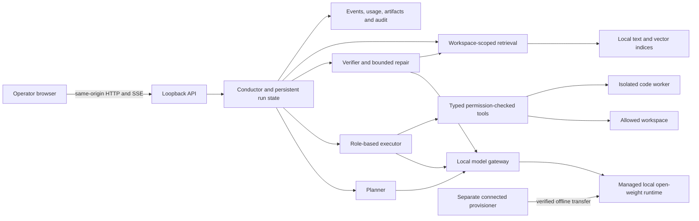

# BlackBox Workspace architecture

Design and implementation review, 20 September 2026. **Established fact** denotes source inspection or observed behavior; **recommendation/informed inference** denotes proposed engineering choices; **target** denotes work that still needs implementation or evidence. The validation report distinguishes mocked harness tests from real model runs.

## Problem and success criterion

Think of the system as a workshop with a foreman, a document librarian, specialist workers and an inspector. The workers share local tools and records; none needs an Internet service. The foreman records dependencies, the librarian retrieves supporting documents, the workers produce files, and the inspector checks the actual output. A locked workshop still needs a building perimeter: application restrictions alone cannot isolate every executable on the host.

**Established fact:** the supplied [SIH26117 page](https://www.sihbuddy.in/ps/SIH26117) describes a sovereign industrial workbench. A [secondary statement mirror](https://sih-26-copilot.vercel.app/problem/sih26-26117) uses a 120B-class constraint. The official SIH page was unavailable during verification. The user's 128B figure therefore remains unresolved against the authoritative statement. This implementation conservatively rejects models at or above **120B total stored parameters** and caps managed resident parameter sums when residency management is enabled. Active MoE parameters and quantized file size are not substitutes for total parameters. Tied/shared tensor conventions still require model-card review.

**Recommendation:** compete on reproducible industrial correctness, traceable evidence and demonstrable isolation. “Better than Claude Code/Codex” is a benchmark hypothesis, not an architectural property. A larger agent graph does not make a weaker model more intelligent; extra agents can repeat the same error and increase latency. Use the smallest workflow that passes independent checks.

## Boundary and data flow

**Established fact:** portable runtime inference endpoints are loopback only. The frontend bundles its assets locally and sets a same-origin content policy. The provisioner is a separate program, not a workbench download endpoint. The source code necessarily contains local HTTP clients and setup download code: “no requests anywhere” would also prohibit the browser and model server from communicating. The enforceable requirement is **no external runtime egress**.

The trust boundary includes source documents, model output, tool arguments, installed model binaries, extensions, local users and OS/network configuration. Documents and model output are untrusted. Host administrators and the cloud infrastructure provider are outside the protection of an application sandbox. Local databases, prompts, caches, traces and generated outputs are confidential too; use encrypted storage, restricted accounts and reviewed backup policies.

## Implementation map

| Component | Current implementation | Limit or next gate |
|---|---|---|
| Browser workbench | Tasks, model selector, workspace files, evidence search, streamed events, cancellation, artifacts and history | Single operator; no enterprise tenant isolation |
| Model discovery | GGUF inspection, local registry, configurable local engine, static verified catalogue and capacity estimates | Catalogue is curated, not every model on the Internet; load/speed must be measured |
| Gateway | Structured JSON, capability routing, explicit model pin, retries, token accounting, local transports | Failed model availability does not automatically prove another model is better |
| Resource management | One resident model default, serial inference, optional larger resident cache, CPU/GPU/context controls | No automatic free-VRAM scheduler or universal hardware optimizer |
| Workflow | Goal preservation, bounded plan, role assignment, dependencies, execution, review, retries/escalation, budget/time limits | Compact mode deliberately serializes a small plan; semantic quality depends on weights |
| Files | Read/write/edit tools constrained to workspace, traversal/UNC rejection, actual output inspection | Same-user filesystem race attacks require stronger OS isolation |
| RAG | Local BM25; optional local dense retrieval/reranking; structured document parsing; source locators | Scanned-only input needs configured OCR; live dense/vision quality not established here |
| Calculations | Bounded arithmetic plus unit-aware quantity algebra | Formula applicability and source truth still need validation |
| Generated code | Docker/bubblewrap backends; no code execution when isolation is disabled | Native Ubuntu WSL2 bubblewrap execution and isolation probes exercised; Docker remains unvalidated |
| Validation | Programmatic checks, literal content check, reviewer reads artifact and independent source excerpts | A reviewer is not a proof of engineering correctness |
| Security | Strict Linux CPU namespace with native parent/child checks; loopback bridge, authenticated local API, private model keys, Python guard | Per-deployment packet evidence, GPU isolation review and independent audit remain required |
| Observability | Persisted runs/events/usage, local traces, tool records and audit chain | No externally anchored tamper proof against host administrators |

## A task, from input to output

1. **Admission:** require an existing allowed workspace, valid mode and a real available model. Portable mode permits one active top-level run. Enforce both at the API and conductor boundary; saved sessions are rechecked before execution.
2. **Grounding:** discover eligible local files under the workspace and update its own collection. Preserve the user's objective, including literal text and constraints. Do not index arbitrary home directories simply because a model asks.
3. **Retrieval:** search the relevant workspace collection. Attach bounded passages with source IDs. Exact equipment tags benefit from lexical matching; semantic embeddings are optional. Retrieved text is evidence, not instructions granting new permissions.
4. **Planning:** compact mode asks for one to four necessary steps, assigns analyst/coder/writer/data/drawing roles and validates output paths and dependencies. Simple exact file writes use a deterministic one-step plan. Full harness mode supports richer DAGs, delegation and replanning.
5. **Routing:** select a model satisfying capabilities, context and availability. Small utility/execution roles prefer smaller eligible weights; planning/review can use stronger candidates. A run-level model pin is explicit. Coding specialists use a coder route; embeddings and images require appropriate separate capabilities.
6. **Execution:** the model returns a schema-constrained tool action. Validate arguments, permissions, path scope, tool budget and idempotency before running it. Observations become bounded context. Repeated identical actions trigger a loop guard. Tools do the arithmetic and file operations rather than accepting a model's claim that they happened.
7. **Evidence:** record tool arguments, results, errors, model route and token use. SSE delivers replayable sequence-numbered events and terminal state; a reconnect uses its last event ID. These are progress records, not a guarantee that a reasoning trace is correct.
8. **Verification:** check required files/schema/tests/totals as applicable; inspect actual output bytes; compare exact-text requests literally. The reviewer receives artifact excerpts, recorded calculator results and independently fetched source excerpts. Compact review lists each requested criterion, its evidence and a status before determining acceptance; incomplete coverage or any unresolved criterion fails. Compatibility scores of 90/60 encode these two bands, not a probability of correctness. Deterministic failures cannot be overridden by the reviewer. Recheck units, citations, missing evidence and unsupported acceptance limits.
9. **Repair:** feed concrete failures back to the task. Retry/escalate within configured step/token/time budgets; then fail or report gaps. Never replace an exhausted run with a success banner. A user stop cancels the driver and its tracked task children.
10. **Delivery:** show artifacts, sources, usage, completed work and unresolved gaps. Engineering outputs remain drafts for qualified review before any plant operation. This workbench has no automatic connection to plant control equipment.

An exact file request (`Write file.txt containing exactly ...`) is a narrow deterministic contract. After a successful permitted tool action, the executor checks every requested UTF-8 byte. Once they match it stops requesting more model actions; the normal verifier still enforces all hard checks. This prevents a small model from rewriting an already correct file indefinitely. The record labels this verification `deterministic`, not a model review. Reports, calculations and other semantic work continue through evidence-based model review.

## Why physical calculations need a separate tool

**Established fact:** an early live 4B run applied 36 m³/h as 36 m³/s. The ordinary calculator executed that incorrect formula accurately. This is a 3,600-fold error that extra arithmetic precision cannot fix.

The quantity calculator accepts values with their **original units**, converts to SI internally, propagates mass/length/time exponents through arithmetic, and checks the requested output unit. For example `density * gravity * flow * head` with flow in m³/h is converted before returning kW. Adding pressure to length or requesting kW from an expression missing a required length fails. The supported unit vocabulary is explicit; affine temperatures and unsupported units fail instead of being guessed. This addresses dimensional and conversion errors, not an incorrectly selected physical model or falsely transcribed source units.

**Recommendation:** extend this pattern through reviewed domain checkers: material balance, energy balance, pump curves, electrical load, tolerances, dimensional CAD constraints and spreadsheet reconciliation. Each checker needs a versioned formula, units, applicability conditions, authoritative references and test cases. Never let the model invent a safety threshold or change an acceptance test to make its output pass.

## Retrieval design and scaling

**Established fact:** the portable implementation hashes whole files, parses supported local documents, produces chunks and builds a Tantivy lexical index. Hybrid mode adds locally generated embeddings and Qdrant storage, with rank fusion and optional reranking. Workspace collection IDs are derived from canonical paths; API/tools filter source paths again. Reindexing changed or deleted sources removes stale text chunks. The active embedding model participates in fingerprints so changing embedding configuration triggers reindexing.

Current limits include 2,000 eligible discovered files per indexing request and 25 MiB per file; exceeding the discovery limit fails visibly. Hidden/dependency folders are excluded; `.yantraignore` currently uses simple prefix/substring rules, not complete Git ignore semantics. Scanned-only documents fail when there is no extractable text. Mixed scanned/text coverage requires additional page-level validation. Old dense points can remain physically stored after text deletion, although missing database chunks are filtered from search results.

**Recommendation:** for 10× scale, move ingestion into durable workers, keep per-document failure/coverage status, batch embedding jobs and add cancellation/checkpoints. For millions of files, add a dedicated metadata database, vector shards, ACL-aware retrieval, revision grouping, deduplication, table/figure representations and retention/deletion jobs. Do not claim 10⁷-document scalability based on a small synthetic corpus. Evaluate recall separately for equipment tags, paraphrases, scanned tables, conflicting revisions and “no supporting evidence” questions.

## Model selection and memory

**Informed inference:** Q4 weight storage starts near `parameter_count × 0.5 bytes`, plus quantization metadata. Real peak memory also includes KV cache, activations, scratch buffers, runtime and the application. Context length, batch/concurrency, GPU backend, offload and shared memory can dominate the difference between “file fits” and “model runs.” Catalogue runtime numbers are heuristics, not free-memory reservations or benchmark results.

| Tier | Suggested use | Trade-off |
|---|---|---|
| Small general model | File operations, short extraction and routing | Cheap, but fragile tool use and reasoning |
| 4B/8B general model | Planning, common industrial text work and review | More useful reasoning, increased latency/memory |
| Code specialist | Code changes and analysis under an isolated runner | Additional weight storage and swap cost |
| Small embedding model | Semantic retrieval | Better paraphrase recall; ingestion cost and another model slot |
| Vision model + projector | Scans, drawings, images | Separate setup and evaluation; hallucinated geometry remains a risk |
| Larger below-cap model | Difficult tasks on adequately provisioned servers | Must justify cost through task success measurements |

**Recommendation:** start with one general model and lexical retrieval. Add each specialist only when a held-out benchmark demonstrates a gain. Prefer pre-quantized Q4/Q5 artifacts with known provenance; compare quality to higher precision on your task set before approving a quantization. Maintain measured manifests per host: model/runtime hash, context, offload layers, peak RAM/VRAM, first-token latency, decode rate and task accuracy. Do not equate “8B” with “small enough for VRAM” on every device.

The current serial gateway avoids evicting a model while another inference request is in flight. Higher resident counts reduce reloads; they do not create parallel model inference. A future multi-GPU scheduler needs explicit per-device memory reservations, in-flight leases, queue admission, cancellation propagation and aggregate parameter enforcement across replicas. A fixed `--parallel-tasks` value is not that scheduler.

## Security layers and verification contract

| Layer | Enforced behavior | What it cannot establish alone |
|---|---|---|
| Browser | Local assets; restrictive CSP; same-origin API; no external font/CDN dependency | A hostile extension or compromised browser |
| API | Loopback binding, host/origin checks, optional key and expiring HttpOnly cookie | Strong isolation from other processes running as the same user |
| Model server | Loopback managed endpoints and random per-process authentication key | Safety of a compromised native runtime |
| Python/library | Offline flags, disabled proxy inheritance/redirects in inference clients, guarded DNS/socket calls | Native networking bypasses |
| Tools | Typed inputs, workspace path checks, permissions, explicit sandbox requirement | Host-level kernel vulnerabilities or filesystem races |
| Code worker | No-network Docker or bubblewrap; no runtime image pull | Misconfigured daemon privileges or untested host policies |
| Host/network | Recommended systemd cgroup IP denial, firewall and disconnected/private infrastructure | Confidentiality from host/cloud administrators |

**Recommendation:** release a security evidence bundle with independent native egress probes, IPv4/IPv6/DNS/UDP and cloud-metadata tests, packet captures, allowed loopback checks, artifact hashes and exact policy files. A signed report only authenticates its signer; it does not make an incomplete test comprehensive. The UI intentionally distinguishes application policy from OS attestation.

Supply-chain controls should include locked dependencies, offline wheel/container archives, SBOM, license review, vulnerability review, source verification and change approval. Third-party plugins, shell tools and MCP servers are code within the boundary; keep them disabled until individually reviewed. Do not store production credentials in prompts, traces or exported evaluation results. Implement retention and audited deletion for confidential artifacts before long-term use.

## UI decisions

**Established fact:** the workbench has a persistent navigation column, central task surface and evidence/output panel. It exposes workspace scope, model choice, task mode, live progress, stop control, files and artifacts. Models separates installed models from downloadable candidates and shows detected host capacity. Security reporting avoids a universal “sealed” guarantee. The optional login screen uses a local access key without browser storage of the secret.

**Recommendation:** retain familiar coding-agent interaction patterns without cloning branding. Show errors next to the failing step, preserve partial artifacts with clear status, display source revision/coverage, and distinguish “calculated,” “model-reviewed” and “engineer-approved.” Do not add decorative agent activity that has no corresponding persisted event. Keyboard access, readable contrast, long-path layout and narrow-screen testing belong in the release checklist.

## Evaluation and SIH demonstration

The demonstration should begin with network isolation evidence, then a fresh unseen local task: find relevant sources, identify missing information, calculate using checked units, write a file, expose an intentional failed check, repair within budget, and show provenance. A second demonstration should use a drawing or scan only after a real local vision model has passed a documented test. A third should change code and run tests inside verified network isolation.

Measure task success, unsupported-claim rate, citation correctness, retrieval recall, unit correctness, repair success, false acceptance, time to first useful event, total elapsed time, tokens, peak memory, reload time and outbound packet count. Use multiple runs per task and report failures, not just the best run. Scripted mocks test orchestration but cannot substantiate model intelligence. Compare to a single-agent local baseline first, then any commercial baseline using the same nonconfidential inputs, budgets, rubric and independent graders.

**Target, not current evidence:** no benchmark yet demonstrates superiority over Claude Code or Codex, production readiness at refinery scale, complete multimodal extraction, or a universal zero-egress guarantee. The current changes provide a working, inspectable foundation and expose these gaps instead of masking them.

## Linux execution and recovery update — 21 September 2026

See [strict deployment](STRICT_DEPLOYMENT.md) for the implemented OS boundary. Activity frames are durable SQLite records replayed over SSE. Local coordinator ownership protects database initialization and active lifecycle. Explicit Python execution contracts require a persisted successful tool result. Fresh JSON outputs can move directly to normal verification, preserving semantic review and bounded repair. Per-command CPU and peak-memory accounting uses a dedicated parent process; the old process-wide counter was invalid when model engines had exited. [Validation evidence and retained failures](VALIDATION_REPORT.md).
